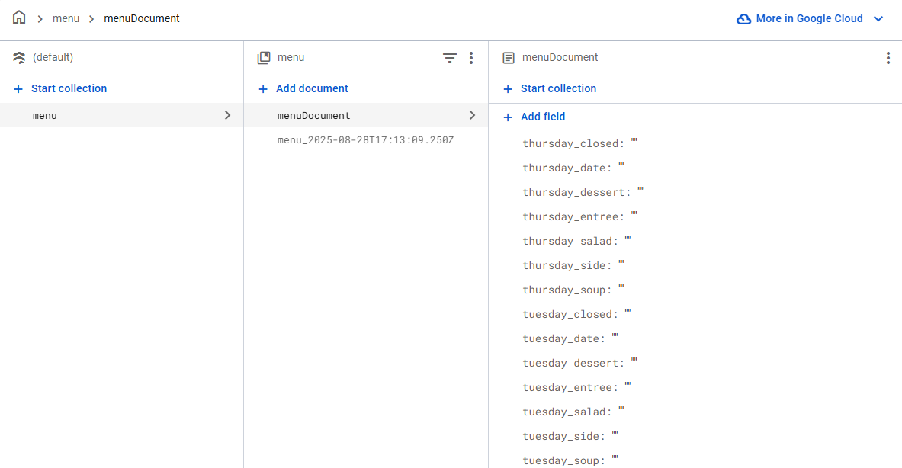

# How to set up firebase 2025

## Connecting Firebase
First, go to <a src="https://console.firebase.google.com/">FireBase</a>.<br>
Then, click the "Create new FireBase Project" button. Disable analitics. <br>
Under "Get started by adding Firebase to your app" click the </> icon.<br>
Copy and past the "firebaseConfig" into the corresponding sections on uploadMenu and index.<br>
<br>

## Setting up FireStore
On Your Firebase Console, select FireStore.<br>
Select Create Database, standard edition, nam5, production.<br>
In rules tab, change rules to:<br>
```
rules_version = '2';

service cloud.firestore {
  match /databases/{database}/documents {
    match /{document=**} {
      allow write: if request.auth != null;
      allow read;
    }
  }
}
```
In Data, Set up data as shown<br>

<br>

## Authentication
Authenication is truely simple, as the code is already up to date!<br>
Just click Get Started in the login page, then turn on email/password.